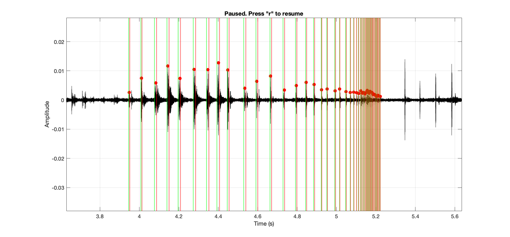
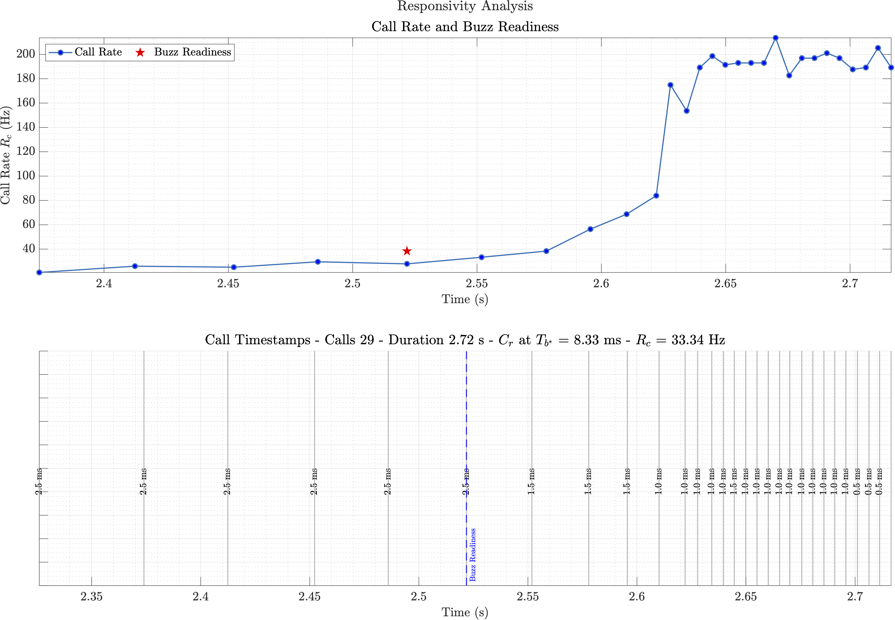

# Biosonar Responsivity Analysis Toolkit


This repository contains a MATLAB toolkit for analysing biosonar call timing and responsivity in echolocating animals, primarily bats. The toolkit includes interactive call selection, call timing analysis, visualisation, and an easy-to-use object-oriented interface.

---

## Related Publications

For detailed theoretical background and method descriptions, please refer to the following papers:

- [Biosonar Responsivity Sets the Stage for the Terminal Buzz (2025)](https://www.biorxiv.org/content/10.1101/2025.06.16.659925v1)

- [Temporal Precision Necessitates Wingbeat-Call Asynchrony in Actively Echolocating Bats (2025)](https://www.biorxiv.org/content/10.1101/2025.06.18.660328v1)

---

## Features

- **Interactive Call Picker**  
  An intuitive GUI for selecting call timestamps and durations directly from audio waveforms. Users can adjust call boundaries, zoom, undo/redo, and mark precise call peaks. (See below).

- **Responsivity Analysis**  
  Computes key temporal parameters such as inter-pulse intervals (IPI), echo delays $$T_a$$, biological reaction times $$T_b$$, and the responsivity metric $$\mathcal{R}$$ that captures call timing precision dynamics.

- **Visualization Tools**  
  Generates informative plots including call rate over time, buzz readiness markers, call duration annotations, and responsivity curves with highlighted inflexion points.

- **Object-Oriented Interface**  
  The `BiosonarResponsivity` class integrates audio loading, interactive call selection, analysis, plotting, and export functionalities into a streamlined workflow.

---

## Installation

Clone or download this repository and add its folder to your MATLAB path.

```bash
git clone git@github.com:raviumadi/analyse_responsivity.git
```
Then, in MATLAB:

```matlab
addpath('path_to/analyse_responsivity');
```

## Quick Start
See the `examples` folder for the starting script. Check the [tutorial](tutorial/responsivity_tutorial.pdf) for a detailed description.

```matlab
% Create a BiosonarResponsivity object with an audio file, responsivity factor, and max call rate
bsr = BiosonarResponsivity('path/to/audio.wav', 5, 180);

% Launch interactive GUI to select calls
bsr.getCallTimestampsInteractive();

% Perform responsivity analysis on selected calls
bsr.analyseResponsivity();

% View analysis summary in the MATLAB console
bsr.summary();

% Visualise the responsivity curve and detailed call timing results
bsr.plotResponsivityCurve();
bsr.plotDetailedResults();

% Plot temporal precision curves
bsr.plotIPI();

% Export all plots and results to a specified folder
bsr.exportResults('path/to/save/folder');

```

## Workflow Details

---

### Special Note

An underlying requirement for the most reliable analysis is a complete call sequence collected in a direct pursuit setting. The field data provided is highly variable, and the regions of buzz readiness do not correspond to direct target pursuit; hence, interpreting the $$T_{b^*}$$ must be approached with caution. 

----

###	Interactive Call Selection

The GUI allows manual annotation of echolocation calls on the waveform plot. Use keyboard commands to start, pause, resume, adjust boundaries, undo, and exit. 

- `s` - Start annotation
- `p` - Pause. You can resize, zoom in/out while paused. **Unselect the plot tool before resuming**
- `r` - Resume annotation
- `x` - Finish and exit annotation
- `uparrow` `downarrow`  - Resize vertical call boundary.
- `leftarrow` `rightarrow` Move call boundary left/right.
- `y` - Remove the last marking.
- `ctrl/cmd+z` - undo last change.

### Responsivity Analysis

Once calls are selected, the analysis computes:

- IPIs and instantaneous call rates
- Echo delay $$T_a$$ estimated from IPIs and the responsivity scaling factor
- Biological reaction time $$T_b$$ as a proportion of $$T_a$$
- Responsivity metric $$\mathcal{R}$$, quantifying call timing adjustments
- Buzz readiness, the point of maximal responsivity, indicates the approach to terminal buzz

<div style="text-align: center;">
  
  <p><em>Demonstration of a fully selected call sequence using the interactive call selection tool.</em></p>
</div>

###	Visualization

Plots highlight call rate dynamics over time, call timings with duration annotations, and the responsivity curve with key points for intuitive interpretation.

<div style="text-align: center; margin-top: 40px;">
  
  <p><em>Example responsivity analysis plot generated by the toolkit.</em></p>
</div>


### Exporting Results

All analysis outputs, figures, and metadata can be saved to organised folders for documentation and further study.

## Requirements
- MATLAB R2019b or later (compatible with earlier versions but not tested)
- No additional toolboxes are required.

## License

This work is licensed under a Creative Commons Attribution-NonCommercial 4.0 International License (CC BY-NC 4.0).

## Contributing

If you wish to develop the tool further, perhaps including a full GUI, please feel free to fork. Alternatively, for added examples, your own versions of analyses, do send pull requests.


> With great speed comes greater responsivity


